# Project Documentation

This site provides project documentation.
Use the documentation navigation to explore.

## How-To Guide

Many instructions are common to all our projects.

See
[⭐ **Workflow: Apply Example**](https://denisecase.github.io/pro-analytics-02/workflow-b-apply-example-project/)
to get the example projects running on your machine.

## Project Documentation Pages (docs/)

- **Home** - this documentation landing page
- [**Project Instructions**](./project-instructions.md) - the standard project workflow
- [**Your Files**](./your-files.md) - how to copy the example and create your version
- [**Glossary**](./glossary.md) - project terms and concepts
- [**API**](./api.md) - autogenerated code documentation for the public project interface

## Example Storytelling Question

The example project answers this business question:

> Which product category contributes the most sales in the selected region,
> and when are its sales strongest?

The example follows a general BI storytelling process:

1. Define one clear business question.
2. Identify the data needed to answer it.
3. Summarize the data.
4. Create charts that provide evidence.
5. Identify the most important results.
6. Explain the findings in your documentation.
7. Recommend an action or next question.

Your project should follow the same general process,
but answer a different business question.

# Phase 4. Technical Modification

- The small modification that I made to the example project was modifying the code in order to compare sales of the regions for 2024 and 2025.
- This change was in between moderate and challenging. It took some time to understand how to modify the code correctly.
- Once the code was properly written, a new chart generated along with a new project report log.

## Phase 4 Evidence

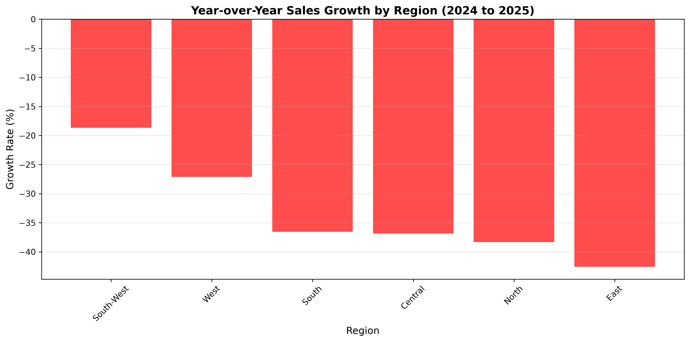
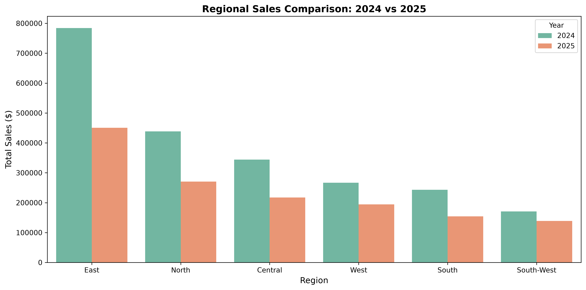
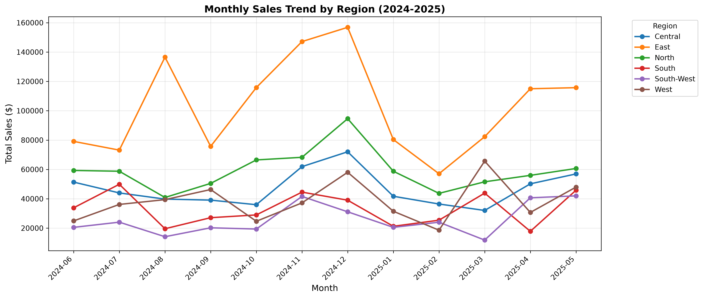

# Phase 5. Custom Project

The Custom project I choose to do for this project was investigating the sales of 2024, the first half of 2025, and then forecasting the sales for the months of June 2025 to December 2025.

## Business Question

Last year which region had the strongest sales, which region has the weakest sales, and do those number still hold true for the current year?

### Explanation

There are a few different reason that it is essential to know which region (and categories) had the strongest and weakest sales within a year.

- This information is needed for a company to know where they should allocate their time/energy, resources, and budget in order to ensure maximizing profitability.
- Inventory control/improving cash flow
- Labor scheduling/Eliminating Underperformance
- Pricing Strategies/Identifying Marketing Trends

## The Data and Analysis

- The data that I started with came from sales_reporting_cjjade.csv. I used PowerBI to transform the data, so I could focus on sales for 2024 and 2025.
- Later I wrote a code that used the data from sales_reporting_cjjade.csv. to create a second csv file called forecasts_2025-06_2025-12_lgb.csv. This data was used to create the forecasted charts.

## Question Analysis & Evidence

### First Part of my Business Question

- I focused my data around the sales of 2024 and the first part of 2025. I created a pie chart for both 2024 and 2025, to show the count of sales per category.

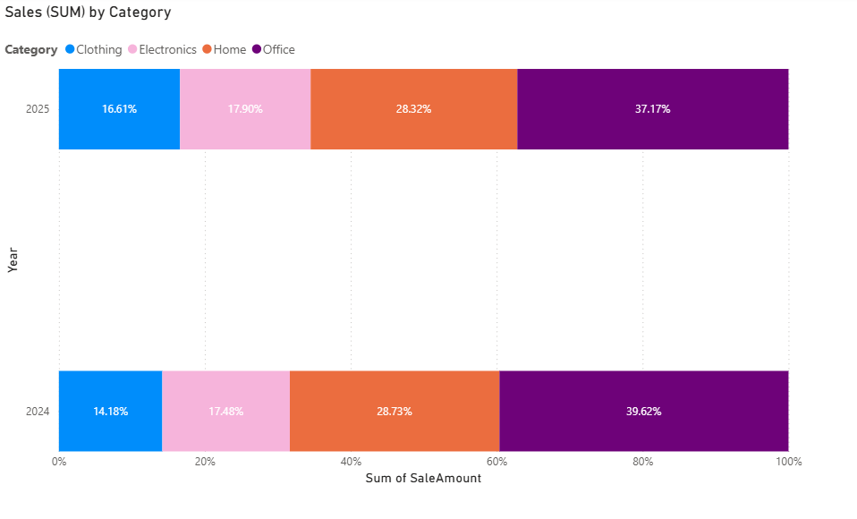
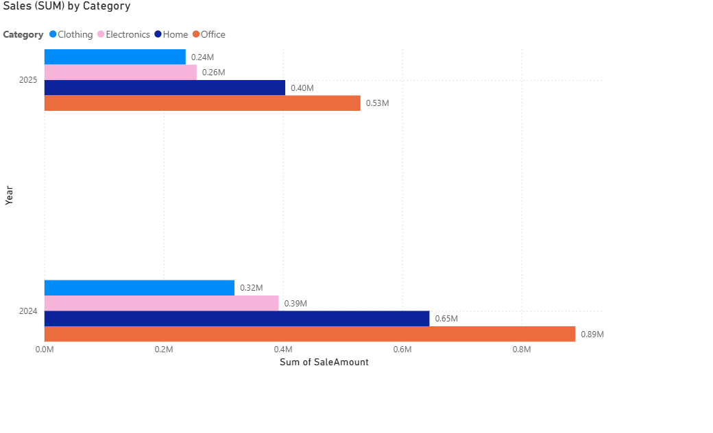
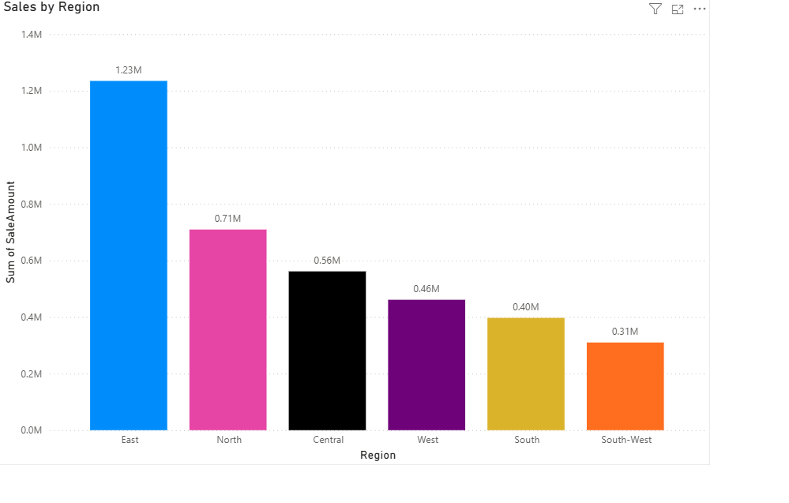

- For the third and fourth chart I showed the sales by sum for each category. I created two different styles to showcase dollar amount and percentage.

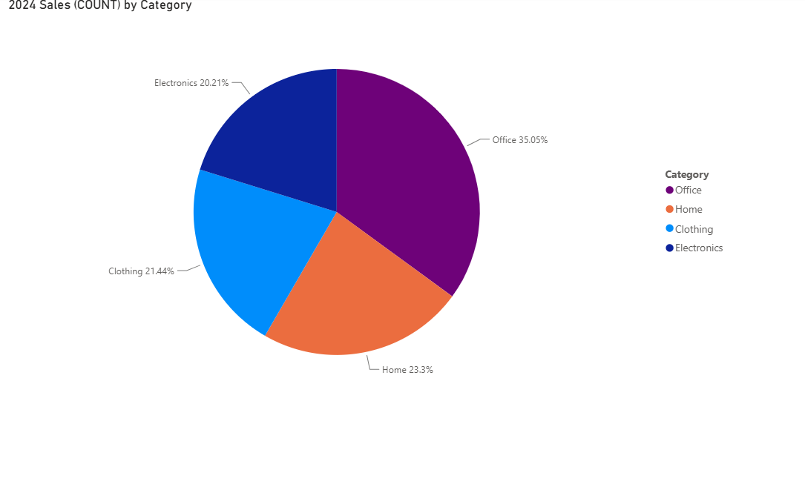
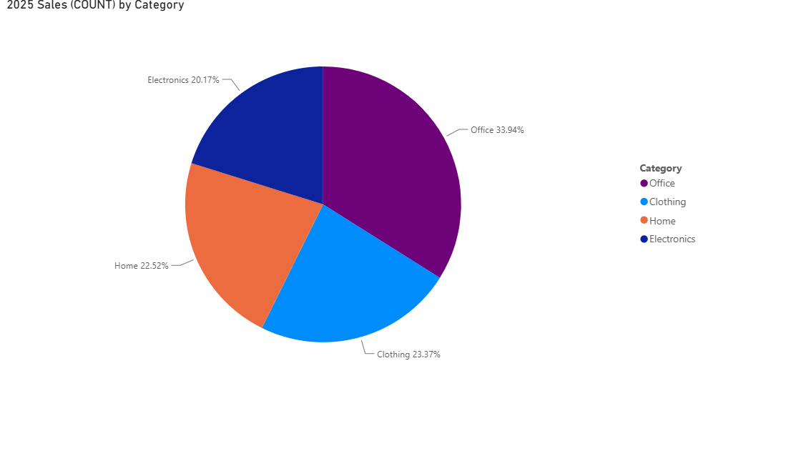

### Second Part of my Business Question

- I created a code which can be found in src/bizintel/forecast_lightgbm_jun2025_dec2025.py. Using the data found in sales_reporting_cjjade with PowerBI enabled me to forecast June to December 2025.
- One of the output of this code is a new csv file was generated that gave the forecasted end of month sales total for June to December. Named forecasts_2025-06_2025-12_lgb.csv, loctaed in root folder.
- To generate the chart/HTML I created two new files, src/bizintel/viz_forecast_static and src/bizintel/viz_forecast_intercative. The files worked with forecasts_2025-06_2025-12_lgb.csv to generate charts.

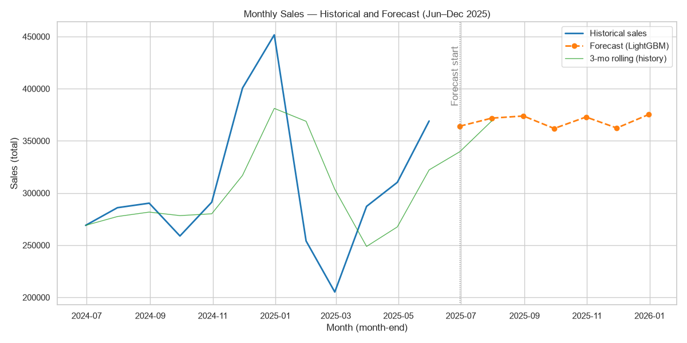

[View Interactive Sales Forecast](https://cjjade-debug.github.io/bintel-06-storytelling/outputs/sales_forecast_2025_jun_dec.html)

- Below are two forecasting charts I created in PowerBI (weekly line graph of sales)
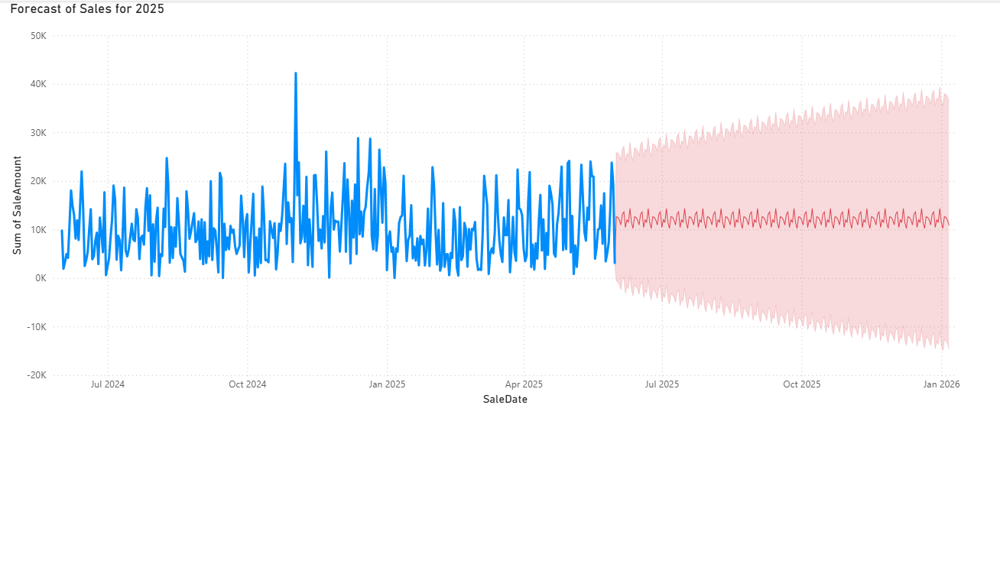
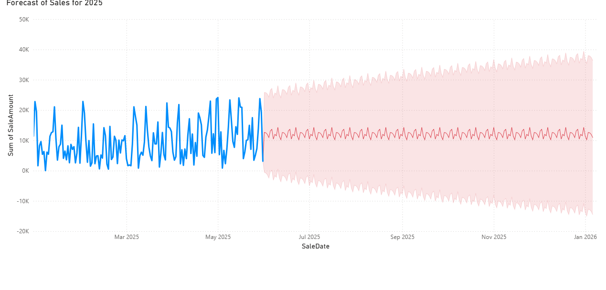

## Findings and Recommendation

### 2024 & 2025 Sales

- My finding shows that the East region is consistently out selling each region. The next behind them is the North region. The lowest of the regions has been shown to be South and South-West.
- The next question that comes to mind, is why is this happen? What can we do to recover?
- According to the data, the East is doing on average .85 million more than the South and South-West. It would be my recommendation to find out more, in order to develop a performance improvement plan.

### Forecasting Sales

- The forecasted sales is consistent but does not give the numbers we show in 2024, again the question that stands is why? What happened?
- The lowest month recorded was March since then the company has managed to rise in sales consistently. This is still startling as January was the highest grossing month on record.
- It is vital as a company we figure out why the drop in sales in February and March happened.
- Looking into customer engagement is a key in this step, as the data supports the claim we are losing loyal customers to competitors.

## Storytelling Final Thoughts

### Question Summary

- The first part of my business question I set out to answer, was which regions were the strongest and weakest in sales.
- **Strongest:** East holds the position as the strongest, with the North coming right behind them. The strongest category showed to be Office category.
- **Weakest:** The South holds the position as the weakest with the South-West coming very closely behind them. The weakest category showed to be the clothing category.
- The second part of my business question was about the future of sales, and how this can help anticipate for the second half of the year.
- The data while consistent is not where I think we could be. The company started out strong in January, but something occurred, to drop sales dramatically.

### Data and Evidence Summary

- The data I started with was a large dataset, I used PowerBI to transform the data and focus on the 2024 and 2025 Sales Amount and Categories.
- Used PowerBI to forecast June to December 2025 sales data, this was in connection with the Python files I wrote to forecast and generate a csv file and visual charts.
- The Forecast CSV file that was generated by python only gave month end sales numbers, the chart from PowerBI gave weekly sales number.
- I used both of these charts together, as they gave two perceptions of possibilities for the second half of 2025.

### Final Reflection

- **Insights:** I have worked with forecasting in previous classes, but this project gave a clearer understanding of how vital this capability is.
Being able to guesstimate can give a better understanding of trends, as well as anticipate upcoming occurrences such as drops in sales or staffing changes.
- **Actions:** In my former role I witnessed our CFO run these exact reports. I know from experience, the next action would be to produce a performance action plan/PIP based on the reports of this analysis.
- **Learned:** What I have learned or taken away, is that business intelligence is interweave in more aspects of every departments within each organization then just the data world.
Having a better understanding of how BI works, and what it entails can give a better understanding of procedures across the board. Enabling better communication, and smooth transitions.
